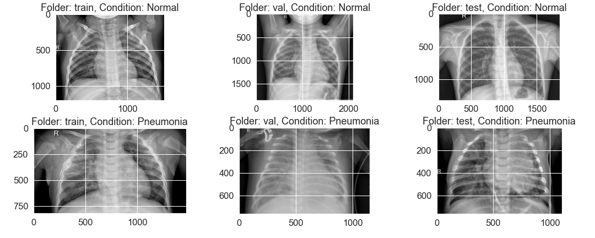
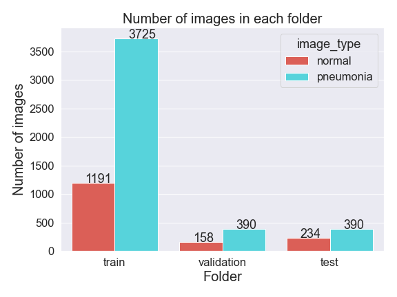
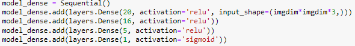
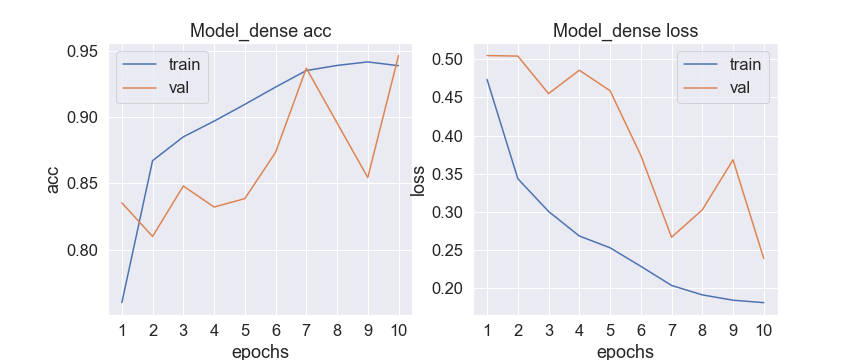
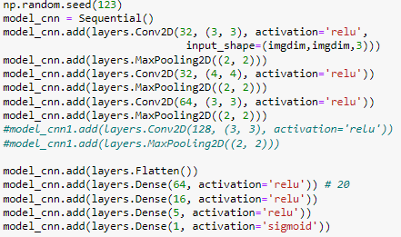
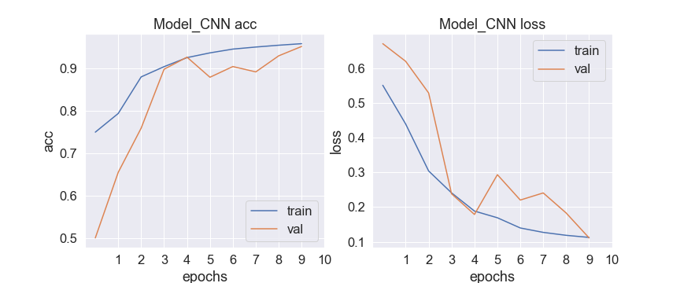

# Phase 4 Project

## Project Overview

In this project, I chosen image classification of chest xray images to see whether it is belonging to a healthy person or a patient with pneumonia(https://www.kaggle.com/datasets/paultimothymooney/chest-xray-pneumonia). 

It is to design classification model to solve a binary classification problem. 

After comparing different neural network and deep learning models with different plays of the data, give suggestions about the classification model that could achieve good accuracy for image classification. 

## Business Problem

* Q: Who are the stakeholders in this project? Who will be directly affected by the creation of this project?
* A: This project is try to develop a deep learning model that could dertermine whether a chest xray image is
*    belonging to a healthy person or a patient with pneumonia
* Q: What data sources are available to us?
* A: the images were downloaded from https://www.kaggle.com/datasets/paultimothymooney/chest-xray-pneumonia

### The Data

The data is download from Kaggle (https://www.kaggle.com/datasets/paultimothymooney/chest-xray-pneumonia), which has been saved in the folder: /figures/, with three folders corresponding to Train, Val, and Test set

### Data Understanding

#### The data I loaded from the website has already been splitted into three subfolders holding the train, test and validation dataset

#####  Some examples of images from three folders are shown below

#### I also count the number of images in each folder and found that there are only 8 images in the original validation folder for normal and pneumonia. Therefore, I moved 150 images from training folder to make the following count of images in each set:

### Image Classification

#### Frist, I tried a baseline fully connected model with differnt number of layers and number of nodes

The history is shown below and the accuracy for test data is 83%

#### Second, I tried CNN model with different settings

The history is shown below and the accuracy for test data is 83%

#### Classification Model Comparisons using different classifiers
- DecisonTreeClassifier
- KNeighborsClassifier
- RandomForestClassifier
- AdaBoostClassifier
- GradientBoostingClassifier

the performance is shown as:

The GradientBoostingClassifier achieves the best results, So I will use this model in the following analysis

Based on its intial parameters, I used gridsearch to find the optimal parameters

param_grid = {
    "loss":["exponential", "deviance"],
    "learning_rate": [0.01,0.1,0.2],
    "min_samples_split": [2,5],
    "min_samples_leaf":[1,2,5],
    'max_depth':[3,5]
    }
    
And the obtained best parameters are:
{'learning_rate': 0.1, 'loss': 'deviance', 'max_depth': 5, 'min_samples_leaf': 1, 'min_samples_split': 2} 

and achieved the results as:

GradientBoostingClassifier final:
confusion matrix: 
 [[2135    6]
 [  40  318]]
accuracy_score:  0.982
recall_score:  0.888
f1_score:  0.933

This result is pretty good, so I will use it as the final model to do the test.

#### Final model with GradientBoostingClassifier

- Parameters:
-loss = 'deviance'
-learning_rate = 0.1
-min_samples_leaf = 1
-min_samples_split = 2
-max_depth = 5
-SMOTE balancing
-StandardScaler

The performance on training and test data are:

Final model for train data:
accuracy_score:  0.98
recall_score:  0.88
f1_score:  0.926

Final model for test data:
accuracy_score:  0.944
recall_score:  0.736
f1_score:  0.797

and the feature importance for the final model is

## Summary

From the classification models, I found that three features affected the customer churn rate most significantly:
- customer_service_calls: The customers with large number of service calls as 4,5,6 seems have the larger churn rate
- international_plan: The customers with international plan have the higher churn rate
- total_day_minutes: The customers with the total day minutes > 315.6, churn rate is 100%, and total day minutes < 46.5, churn rate is mostly 0, therefore, the company need to deal with the customers with the total day minutes     between 46.5 to 316 mins

Regarding states: AZ, AK and HI have the lowest churn rate states, therefore, need to pay more attention on customers from these states