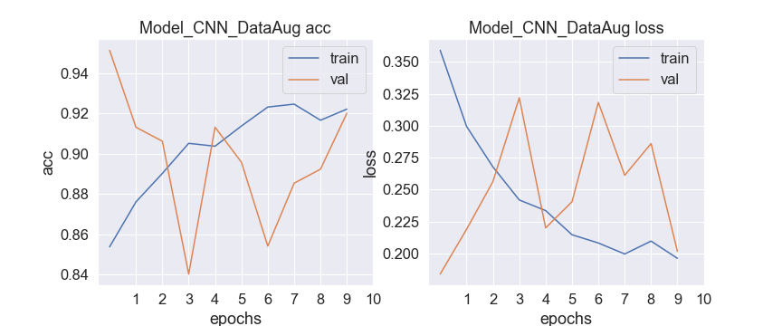
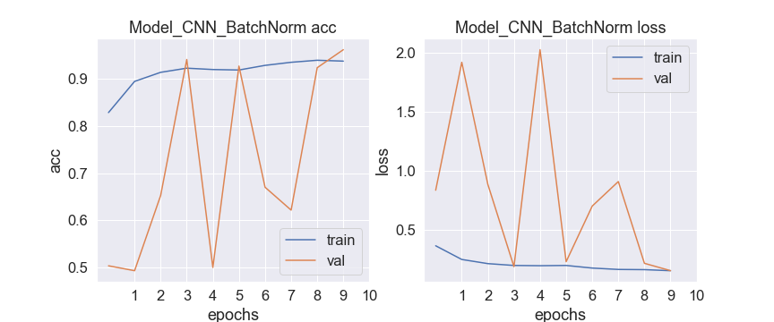
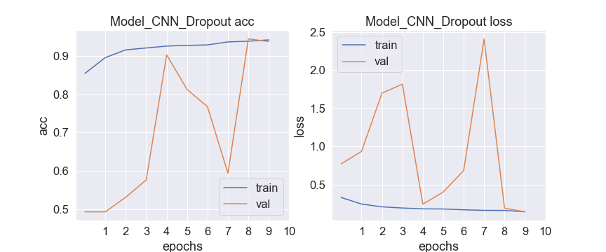
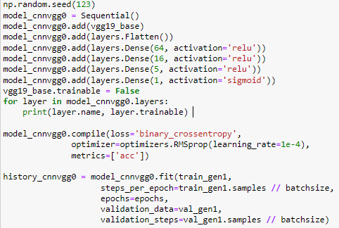
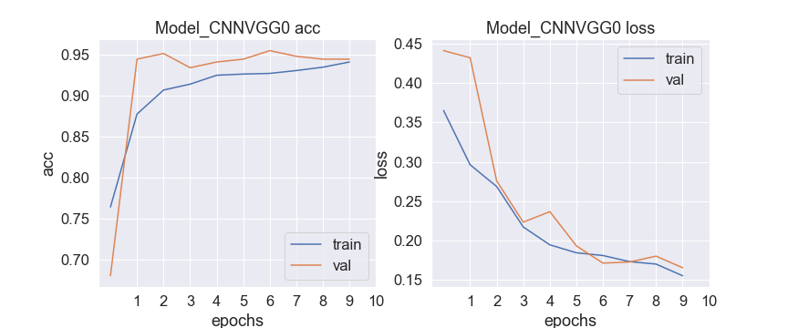
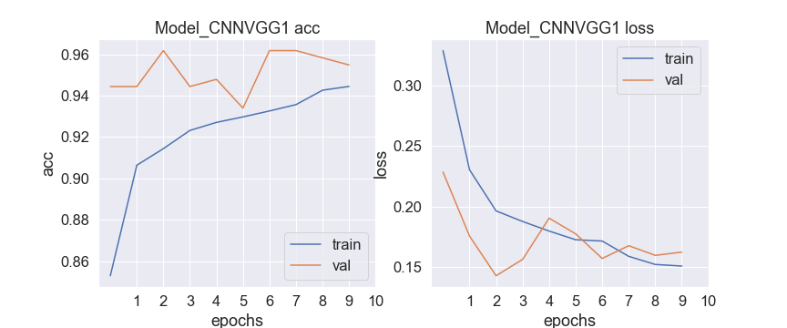
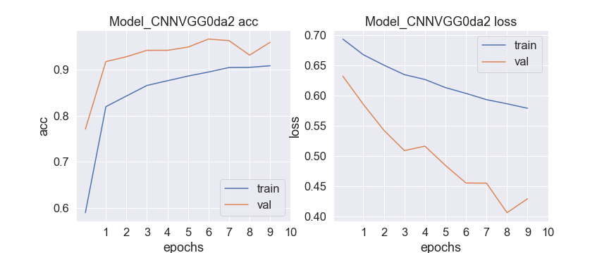
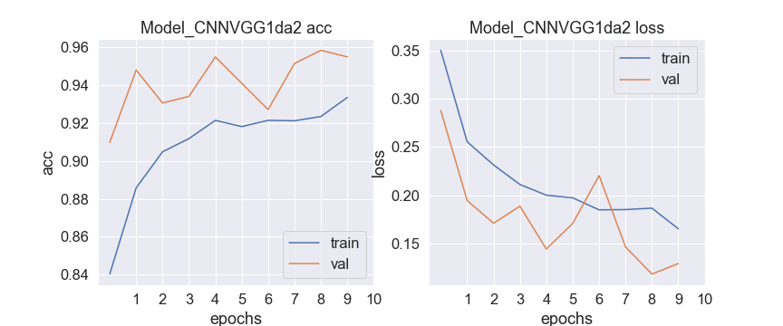
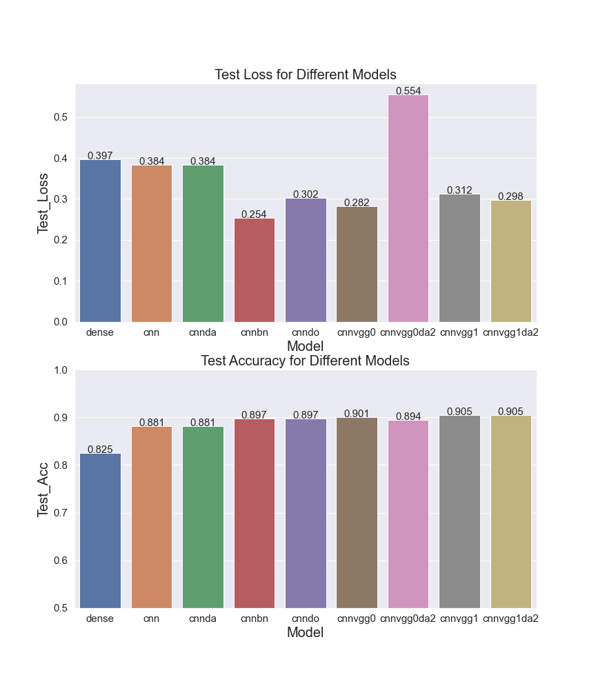
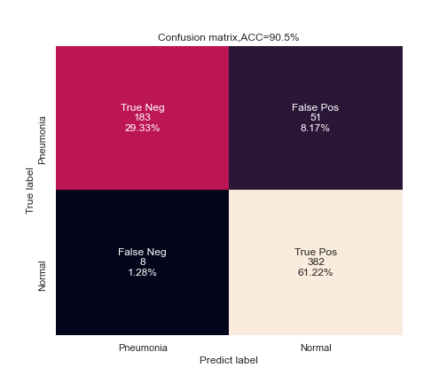

# Phase 4 Project

## Project Overview

In this project, I chosen image classification of chest xray images to see whether it is belonging to a healthy person or a patient with pneumonia(https://www.kaggle.com/datasets/paultimothymooney/chest-xray-pneumonia). 

It is to design classification model to solve a binary classification problem. 

After comparing different neural network and deep learning models with different plays of the data, give suggestions about the classification model that could achieve good accuracy for image classification. 

## Business Problem

* Q: Who are the stakeholders in this project? Who will be directly affected by the creation of this project?
* A: This project is try to develop a deep learning model that could dertermine whether a chest xray image is
*    belonging to a healthy person or a patient with pneumonia
* Q: What data sources are available to us?
* A: the images were downloaded from https://www.kaggle.com/datasets/paultimothymooney/chest-xray-pneumonia

### The Data

The data is download from Kaggle (https://www.kaggle.com/datasets/paultimothymooney/chest-xray-pneumonia), which has been saved in the folder: /figures/, with three folders corresponding to Train, Val, and Test set

### Data Understanding

#### The data I loaded from the website has already been splitted into three subfolders holding the train, test and validation dataset

#####  Some examples of images from three folders are shown below

#### I also count the number of images in each folder and found that there are only 8 images in the original validation folder for normal and pneumonia. Therefore, I moved 150 images from training folder to make the following count of images in each set:

### Image Classification

#### Frist, I tried a baseline fully connected model with differnt number of layers and number of nodes

The history is shown below and the accuracy for test data is 83%

#### Second, I tried CNN model with different settings

The history is shown below and the accuracy for test data is 88%

##### tried data augmentation

The history is shown below and the accuracy for test data is 88%

##### tried batch normalization

The history is shown below and the accuracy for test data is 90%

##### tried dropout

The history is shown below and the accuracy for test data is 90%

#### Third, I tried a pretained model VGG19 with the combination of above cnn model

The history is shown below and the accuracy for test data is 90%

##### Tried to combine vgg19 with a more layers' cnn model

The history is shown below and the accuracy for test data is 91%

##### Tried to use a new data augmentation for two above mentioned vgg19 models

The history of the first model is shown below and the accuracy for test data is 89%

The history of the second model is shown below and the accuracy for test data is 91%

#### Finally, I do a model comparision across nine models with different settings

The accuracy and loss is shown below:

It seems that the cnnvgg models are slight better, though they are generally similar.

#### I chose cnnvgg1 as the final model to see the final classification results

The confusion matrix is shown below:

## Summary

- It achieves above 90% accuracy with the use of pretrained VGG19 model
- With more adjustment and more data, the accuracy could be further improved